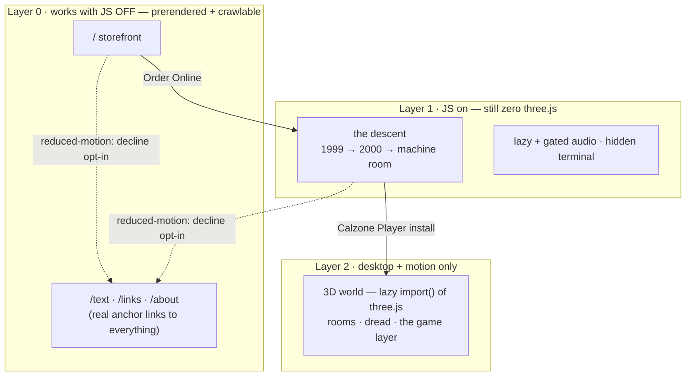

# Architecture

How scoobertdoobert.pizza is wired. The short version: it's a plain, crawlable
website that progressively enhances itself into a 3D game — and almost everything
you can add to it (a link, a floor, a room, a song) is a **data edit**, not scene
code.

For the rules it must never break see [`CLAUDE.md`](./CLAUDE.md); for the vision,
[`docs/DESIGN.md`](./docs/DESIGN.md); for live status, [`docs/PHASES.md`](./docs/PHASES.md);
for where files live, [`STRUCTURE.md`](./STRUCTURE.md).

## Fallback first

The plain HTML storefront **is** the product. Everything else is layered on top
and is allowed to fail without taking the site down with it.

- **Layer 0** is prerendered by `vite-react-ssg` and ships **no three.js**. A
  postbuild guard (`scripts/check-build.mjs`) fails the build if `/` or `/text`
  ever lose their real content.
- **Layer 2** arrives via a dynamic `import()` fired by the fake plug-in install,
  so the storefront downloads none of it up front. It now loads on phones too
  (on-screen touch controls). `prefers-reduced-motion` is the one hard gate: an
  opt-in gate (`MotionConsent`) asks first, with the flat `/text` list as the safe
  default if declined.

## Everything is data

Adding content shouldn't mean editing the renderer. The single sources of truth
live in `src/data/`:

| To add… | edit… | rendered by |
| --- | --- | --- |
| a destination link | `links.ts` | storefront · `/text` · pause menu · hotspots |
| an era floor | `floors.ts` + a template in `src/floors/` | `FloorView` |
| a 3D room | a wing file in `src/data/rooms/` | `World.tsx` + a geometry component |
| an in-world hotspot | `hotspots.ts` (→ a `links.ts` id) | the world |
| a song or cue | `jukebox.catalog.json` + `music.ts` | the jukebox + room ambience |

The room graph under `src/data/rooms/` is deliberately **three-free** — it imports
plain numbers from `src/world/dims.ts`, never `three` — so the store, HUD, and
pause menu can read room data without pulling WebGL into the storefront bundle.
Small tests guard the seams: route ↔ `sitemap.xml` parity, every shipped `.glb`
has a `THIRD_PARTY_NOTICES.md` row, no key ever gates the main descent, and the
arcade registry can't drift from its routes.

## The PS1 look is one pipeline

The crunch is not per-model — it's a shared treatment in `src/world/ps1.ts`:
vertex snapping (round clip-space XY to a coarse grid), affine texture mapping
(the wobble), `NearestFilter` textures with no mipmaps, distance fog for a near
draw distance, and an ordered-dither post pass. Bought GLB environments get
crunched to match (`gltf-transform` at author time, then the same shader
treatment at runtime), so a downloaded room can't look like a different website.

## The dread layer is modulation, not addition

One `unease` value (0→1), scored per-room in `src/data/dread.ts`, is smoothed and
mapped to knobs that **already exist**: a sub-bass audio bed, the PS1 shader
uniforms (jitter / fog / dither), camera bob, the rat's behaviour, and a
persistence-gated curdled line of copy. It builds no new place. Surface zones
(storefront, jukebox, the sweet wings) stay calm by construction, and ascending
always decays it — the safety + taste lines in `CLAUDE.md` hold here.

## The spine that remembers you

`src/state/progressStore.ts` (localStorage, no backend) records depth reached,
secrets seen, games cleared, LUCK banked, and the high-water mark of `unease`. A
returning visitor gets a quietly-changed world; the storefront's one bitter line
only appears once you've actually been deep. That same store powers the game
layer — LUCK earned at the shrine biases a universal d20 (`src/lib/luck.ts`) via
D&D advantage, spent by the system, never by a menu.

## Verifying it

Two complementary layers, spelled out in `vitest.config.ts`:

- **Unit tests** (`*.test.ts`) cover pure logic in node — fast, no DOM, no three.
- **Playwright smokes** (`npm run shoot:all`, ~54 of them) drive the real built
  site in Chromium, including the JS-off storefront, the descent, and each room.
  Shared harness + flows live in `scripts/lib/smoke.mjs`.

Both gate CI (`.github/workflows/ci.yml`: typecheck → lint → format → build →
`shoot:all`). A `shoot:*` script is discovered and run automatically, so adding a
smoke needs no list edit.
