# scoobertdoobert.pizza

<p align="center">
  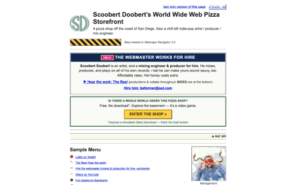
</p>

<p align="center">
  <em>A pizza shop off the coast of San Diego.<br />
  (It is actually a solo music project by a philosopher.)</em>
</p>

<p align="center">
  <a href="https://github.com/lukefwalton/scoobertdoobert.pizza/actions/workflows/ci.yml"></a>
  <a href="./LICENSE"></a>
  
  
  
  
  <a href="https://deepwiki.com/lukefwalton/scoobertdoobert.pizza"></a>
</p>

A deliberately terrible 1996 **Electronic Pizza Storefront** that falls backward
through web history and drops you into a low-poly PS1/N64 world. With JavaScript
**off**, it's an honest, crawlable HTML pizza page. With JS **on**, trying to
order makes it "install" a fake VRML plug-in and descend — through a 1999
GeoCities floor, a 2000 table-layout floor, an SGI parody machine room — into a
real-time 3D shop on the seafloor, which turns out to be the archive of
**Scoobert Doobert**, a philosopher's solo music project.

## The idea

Silicon Graphics built the Nintendo 64's graphics chip and, on its "Silicon
Surf" site, advertised navigable 3D worlds in the browser via VRML in 1996. That
promise never really arrived. This site ships it ~30 years late, as a haunted
pizza CD-ROM: the storefront "requires" the **Calzone Player™** plug-in to order,
and installing it descends you through the eras into the world below.

## The descent

|     |     |
| --- | --- |
| 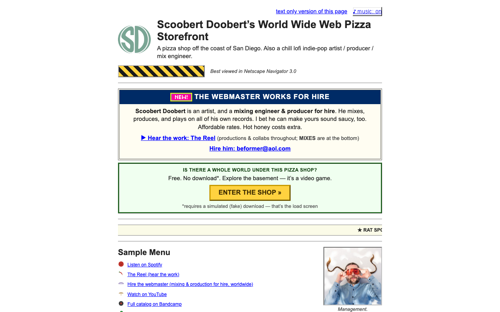 | 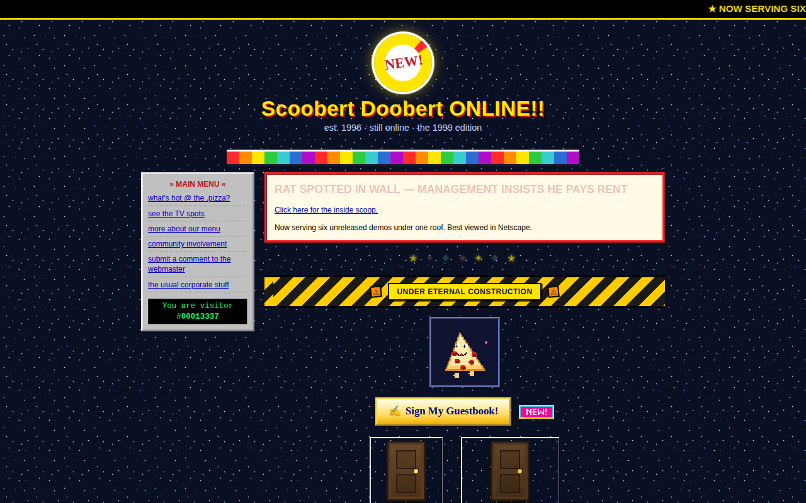 |
| **1996** — the dead-plain front door (works with JS off) | **1999** — GeoCities energy: guestbook, hit counter, eternal construction |
| 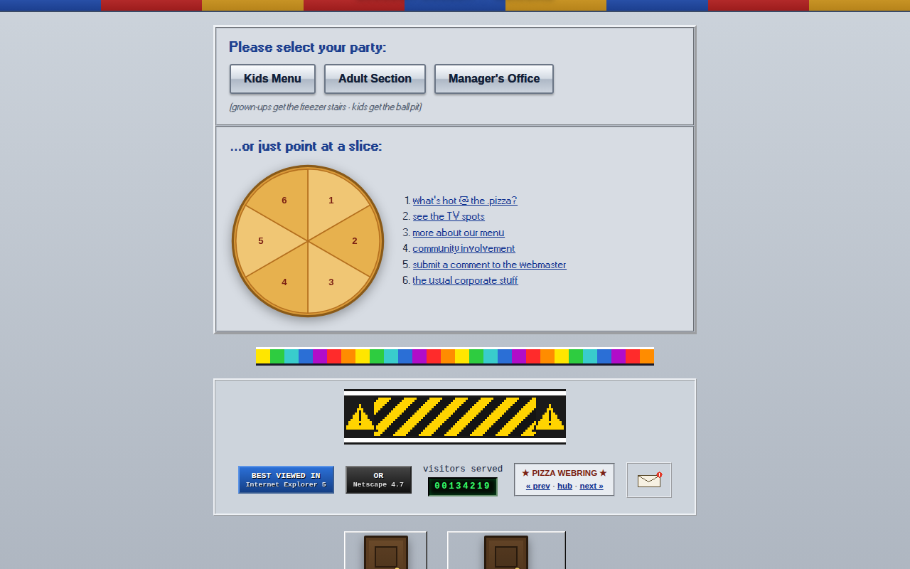 | 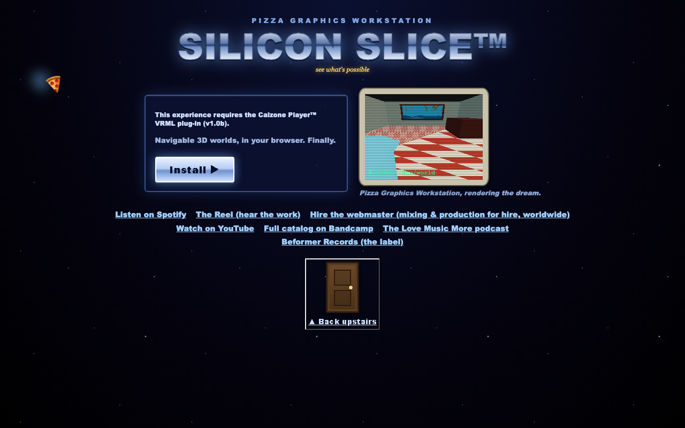 |
| **2000** — table-layout web + a pizza image-map | **the machine room** — SGI parody, live CRT render, the Calzone install |
| 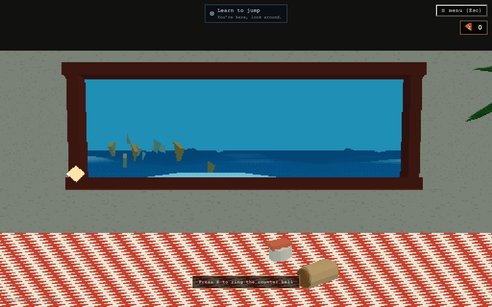 | 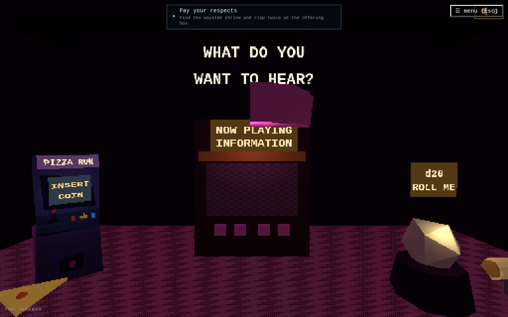 |
| **the world** — a PS1 shop on the seafloor | **the jukebox** — the music payoff (+ a d20 to gamble for a track) |
| 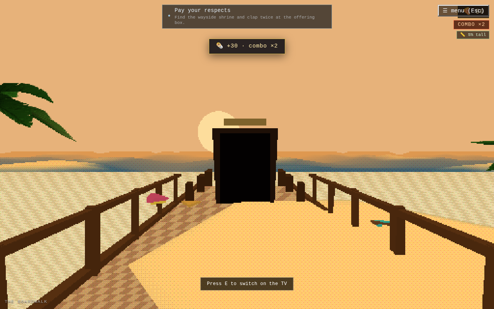 | 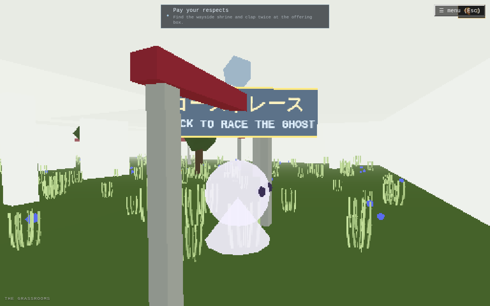 |
| **the boardwalk** — a golden-hour surface wing | **the grassrooms** — liminal grass + a first-person ghost race |
| 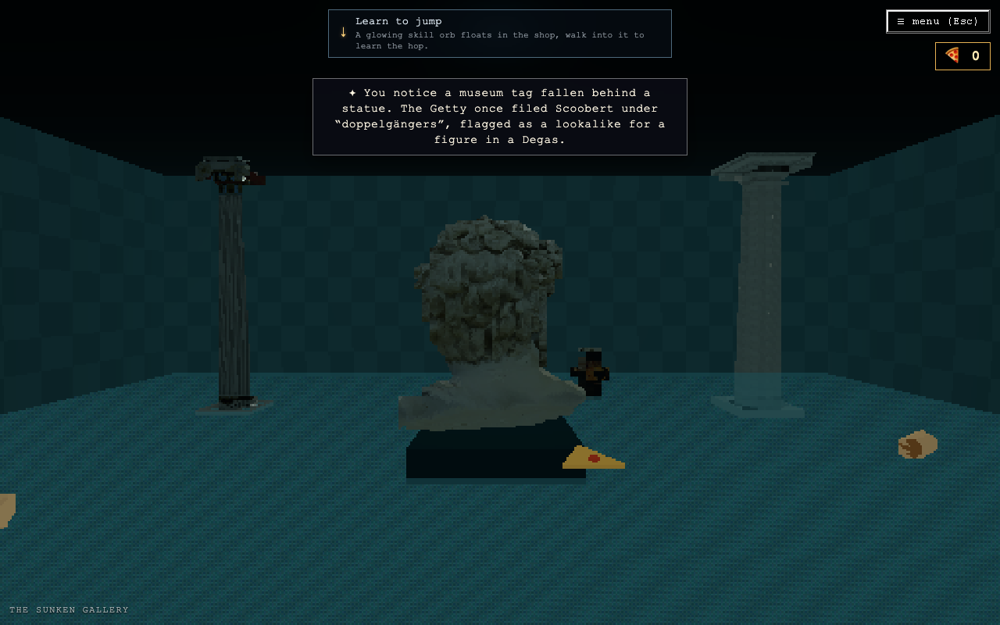 | 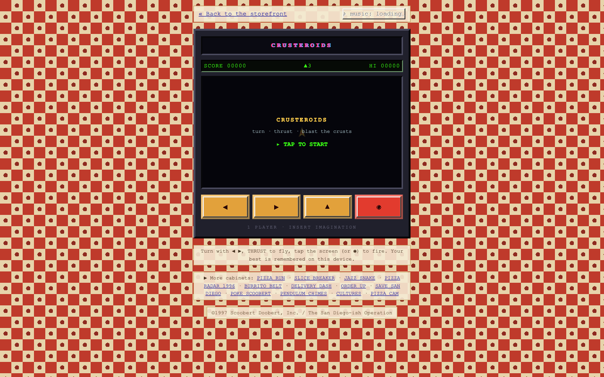 |
| **the sunken gallery** — vaporwave-Greek ruins, knee-deep | **the arcade** — seven touch-first cabinets (this one's Asteroids) |

> Every frame above is the real site — captured by `scripts/make-readme-shots.mjs`,
> and the GIF is stitched + crunched by the repo's own
> [`gif89a` encoder](./scripts/lib/gif89a.mjs) (no image libraries). See
> [`ARCHITECTURE.md`](./ARCHITECTURE.md) for how the whole thing is wired.

## Architecture — fallback first

The plain HTML storefront **is** the fallback layer, and everything else is
progressive enhancement layered on top:

- **Works with JavaScript disabled.** `/` and `/text` are real, prerendered,
  crawlable HTML documents (via `vite-react-ssg`). The initial bundle contains
  **zero three.js**.
- **Every destination is a real `<a href>`, always** — on the storefront, on
  `/text`, and in the in-world pause menu. A link that exists only as 3D
  geometry doesn't count.
- **All WebGL lazy-loads** behind the Calzone Player install gag (a dynamic
  `import()`), so the storefront stays instant.
- **2026 backend under the 1996 skin:** the front door looks like garbage HTML,
  but the JSON-LD (`WebSite` + `MusicGroup` + `Person`), Open Graph/Twitter meta,
  per-route canonicals, and a `sitemap.xml` + `robots.txt` underneath are
  pristine. (The OG card is a real 1.91:1 image; the sitemap is kept in sync with
  the routes by a test.)
- **Mobile** runs the whole thing now — the descent AND the 3D world, with
  on-screen touch controls (a virtual stick + context/jump buttons; drag-to-look).
  **`prefers-reduced-motion`** is the one hard gate, and it's an opt-in: an entry
  point asks ("this has motion — enter anyway?") with the flat `/text` list as the
  safe default. JS-off always gets the storefront + `/text`.

See [`ARCHITECTURE.md`](./ARCHITECTURE.md) for how it's wired,
[`CLAUDE.md`](./CLAUDE.md) for the rules + PS1 hard constraints,
[`docs/PHASES.md`](./docs/PHASES.md) for the roadmap + live status, and
[`docs/DESIGN.md`](./docs/DESIGN.md) for the vision + systems. [`STRUCTURE.md`](./STRUCTURE.md)
maps the repo.

## Run

```bash
npm install
npm run dev        # vite dev server
npm run build      # static prerender via vite-react-ssg -> dist/ (+ postbuild smoke check)
npm run preview    # serve the built dist/ on :4173
npm run typecheck  # tsc --noEmit
```

## Where things live

- **Add or change a destination link** → `src/data/links.ts`. Single source of
  truth for the storefront menu, `/text`, the pause menu, and the hotspots.
  Every `href` must be real; never `#`.
- **Add or move an in-world hotspot** → `src/data/hotspots.ts`. Each hotspot
  points at a `links.ts` id, so links stay single-source — adding one is a data
  edit, never scene code.
- **Add or change an era floor** → `src/data/floors.ts` (the `FLOORS` array) +
  a template in `src/floors/`. The descent through web history is data-driven;
  see "Adding an era floor" below.
- **Add or change a 3D room** → a wing file under `src/data/rooms/` (the data,
  split by region; assembled by `src/data/rooms.ts` into the `ROOMS` graph) + a
  geometry component in `src/world/`. Rooms connect through 3D **doors**; the
  beach shop is just `ROOMS[0]`. See "The 3D world — rooms" below.
- **Storefront copy / layout** → `src/floors/PlainFloor.tsx` (floor 0); the `/`
  route (`src/pages/Storefront.tsx`) is a thin host around `<FloorView>`.
- **The Calzone install / transition** → `src/components/Descent.tsx` (fires from
  the machine room, the bottom floor).
- **The 3D world** → `src/world/` (`World.tsx` is the lazy entry + room
  dispatcher; `ps1.ts` is the vertex-snap / affine / dither pipeline; `sim.ts`
  is the ported boids steering; `Rat.tsx` is the single-agent guide).
- **In-world HUD / pause menu** → `src/components/WorldHud.tsx`.
- **The link archive** (`/links`) → `links.md` (repo root, single source) parsed
  by `src/data/linkArchive.ts` and rendered by `src/pages/LinkArchive.tsx`. A
  crawlable directory of every Scoobert link; SEO surface + period easter egg.
- **Boot music** → `public/audio/boot.mp3`, a degraded 8-bit bounce built from a
  master by `scripts/make-boot-audio.mjs`. The engine
  (`src/audio/engine.ts`) lazy-loads + decodes it; the music toggle stays
  disabled until it's ready, and if it never loads there's simply no music (no
  synth fallback). The jukebox catalog ships its own degraded loops under
  `public/audio/jukebox/*.mp3` (built by `scripts/make-jukebox-audio.mjs`).

## Repository layout

A full map lives in [`STRUCTURE.md`](./STRUCTURE.md); the short version:

```
├── index.html            # Vite entry (the old hand-built site lives in git history)
├── src/                  # the app
│   ├── pages/            # Storefront, TextOnly, LinkArchive, About (prerendered routes)
│   ├── components/       # Descent, BootLog, WorldHud, OrderForm, MuteToggle, …
│   ├── floors/           # the era-floor descent scenes (+ doors)
│   ├── world/            # three.js world: World, rooms, ps1 pipeline, boids sim
│   ├── data/             # links.ts, hotspots.ts, floors.ts, rooms.ts (single sources)
│   ├── state/            # zustand stores (audio, scene)
│   ├── audio/            # the Web Audio engine
│   ├── lib/ · styles/
├── public/               # shipped static assets (served at /)
│   ├── audio/            # boot.mp3 (boot loop) + jukebox/*.mp3 (degraded loops)
│   ├── press/            # OG card + inline period photos (web-sized)
│   ├── models/           # PS1-crunched 3D level/prop GLBs (see THIRD_PARTY_NOTICES)
│   ├── gifs/             # our own GIF89a-encoded animated GIFs (+ static twins)
│   ├── 1101.html         # the /1101 "save san diego" Twine ARG
│   ├── robots.txt        # + sitemap.xml (kept in sync with routes by a test)
│   └── PIZZA.png, cursor.cur, brand/, textures/ …
├── api/order.ts          # Vercel function: opt-in email capture → Vercel Blob
├── scripts/              # build/verify tooling (shoot:all + the shoot:* suite, make-*-audio, …)
├── media/                # SOURCE originals, NOT shipped (see media/README.md)
│   ├── masters/          # masters wired into the site (boot loop + layer themes)
│   ├── music/            # full master catalog, by year/album
│   ├── sfx/              # sound effects (owned sitar takes)
│   ├── models/           # all .glb source models, grouped by theme (+ IP flags)
│   ├── photos/           # full-res photo archive, grouped by shoot
│   └── brand/            # brand-logo source
├── links.md              # source of truth for the /links archive
├── docs/                 # PHASES.md (roadmap + status) · DESIGN.md (vision + systems)
├── STRUCTURE.md          # the repo map ("start here")
└── CLAUDE.md             # the rules/guardrails (the constitution)
```

**Source media** (full-res photo archive, song masters, raw `.glb` models) lives
under **`media/`** and is intentionally kept **out of the build** — only the
degraded/web-sized/optimized derivatives under `public/` ship. See
[`media/README.md`](./media/README.md), [`media/models/README.md`](./media/models/README.md)
(model manifest + licensing flags), and [`media/music/README.md`](./media/music/README.md).

## The descent — era floors

Going down is going forward in web time. The `/` route is a thin host around
`<FloorView>`, which renders `FLOORS[currentFloor]` by template; each floor is a
real, usable links page you leave through a **door** into the next era:

```
1996 storefront (plain) → 1999 (starburst) → 2000 (tableLayout) → SGI machine
room (machineRoom) → [Calzone install] → the 3D beach shop.
```

The descent is data-driven, mirroring `links.ts` / `hotspots.ts`.

**To add a floor:** add a `Floor` entry to `src/data/floors.ts` (its `links` are
`links.ts` ids, resolved via `resolveLinks`), and — if its look is new — add a
template component in `src/floors/` plus a `case` in `FloorView`. That's it; no
scene code. The rot transition (`FloorTransition`) and progressive audio decay
(`audio.bendToDepth`) come for free, deepening with `currentFloor`.

- **Doors** (`FloorDoor`) are the connective tissue (the same metaphor used for
  the 3D room exits later). `descend()` / `ascend()` live in the scene store.
- **The install** relocated to the machine room (the bottom floor): its button
  calls `requestInstall()`, which jumps `Descent` straight to the installer →
  boot log → world. `exitWorld()` rewinds to floor 0.
- **Mobile / reduced-motion:** the era floors are universal (responsive; the rot
  is instant under reduced-motion). The 3D world now runs on phones too, with
  on-screen touch controls (`TouchControls` + `touchInput.ts`); only the machine
  room's CRT **live** render stays desktop-only. `prefers-reduced-motion` is the
  one hard gate, and it's an opt-in — Install/Continue raise the `MotionConsent`
  gate with `/text` (`TEXT_ONLY_PATH`) as the safe default rather than dropping
  the user straight into the motion.

## The 3D world — rooms

Past the install, the world is a **graph of rooms joined by 3D doors** — the same
"doors all the way down" metaphor as the era floors. The beach shop is just
`ROOMS[0]`:

```
beach shop ⇄ back hall ⇄ jukebox room
                  ⇕
            classified room   (hidden — the rat knocks it open)
```

`src/data/rooms.ts` assembles the graph from per-wing files under
`src/data/rooms/` (split by region so no file is a monolith): each `Room` has
`dims`, a fog/light `palette`, named `spawns`, and `doors` (each door carries its
target room + the spawn to arrive at). It's deliberately **three-free** (it
imports plain numbers from `src/world/dims.ts`, never `three`) so the store and
HUD can read room data without pulling three.js into the storefront bundle.

**To add a room:** add a `Room` to the right wing file under `src/data/rooms/`, a
geometry component in `src/world/`
(its own lights + dressing), and a `case` in `World.tsx`'s `RoomScene`. Wire a
door at each end (and the matching arrival spawn). No other scene code.

- **Doors** (`src/world/Doors.tsx`) are real 3D objects. Walk up (proximity) and
  press **E** or click → `goToRoom` → a black-wipe fade → the room swaps behind
  the black → the camera re-spawns. `transitioning` freezes input for the whole
  wipe. Fade timing is single-sourced (`ROOM_FADE_MS` → the `--room-fade-ms` CSS
  var). A `hidden` door doesn't render until revealed.
- **The rat** (`src/world/Rat.tsx`) is one steering agent: it leads you down the
  hall (seeks a point ahead) and flees if you crowd it. Come far enough and it
  knocks a blank panel — `revealSecret()` opens the hidden **classified** door.
- **The jukebox** is the music payoff: the loop (the site's own song) ducks by
  camera distance (`audio.setProximityGain`) so it swells as you approach. The
  drei `<PositionalAudio>` + real-catalog swap drops in at `JUKEBOX_POS` later.
- Everything else (FP controls, pause menu, the always-reachable links list)
  works in every room; the pause menu is the accessibility guarantee.

## Self-verification (Playwright)

```bash
npm run build
npm run shoot:all       # build once, run EVERY smoke against one preview server
# …or a single suite (each starts/expects its own preview on :4173):
npm run shoot           # storefront desktop/mobile/text + JS-DISABLED parity
npm run shoot:world     # enters the world, asserts canvas mounts, hotspot + modal pause, intro × dismiss
npm run shoot:descent   # storefront → 1999 → 2000 → machine room → install → world → exit; + mobile→/text
npm run shoot:rooms     # shop → hall (rat knocks the secret) → classified → jukebox; doors, wipes, audio duck
npm run shoot:fallback  # mobile + reduced-motion skip 3D, Continue -> /text + /about route
```

**`shoot:all` is the CI gate** (`.github/workflows/ci.yml`): it starts one `vite
preview` and runs every `shoot:*` script — **auto-discovered from `package.json`**,
so the rule is simply: *a `shoot` or `shoot:*` script is a smoke suite and runs in
CI; anything else under `scripts/` (e.g. `make-*`, `lib/`) is a helper and isn't.*
Add a new `shoot:<name>` script and it's covered automatically. A failed suite is
**retried once** (these are full-browser, frame-timed smokes — a real regression
still fails the retry; a one-off slow-runner blip self-heals, and the retry is
logged). The repeated GLB-loader entry + hold-and-poll door-walk flows live once in
`scripts/lib/smoke.mjs`.

In CI the suite is **sharded across runners** for speed: `build` compiles once and
uploads `dist/`; the static checks run as a parallel job; then a `smoke` matrix of
four runners each downloads `dist/` and runs its slice via `shoot:all --shard=i/4`
(round-robin, so the heavy WebGL walk-smokes spread out — each shard gets a full CPU,
which frame-timed smokes need). A final `verify` job is green iff every job passed —
that's the one required status check. Locally, plain `npm run shoot:all` still runs
the whole suite against one preview.

Screenshots land in `.shots/` (gitignored). The `postbuild` step
(`scripts/check-build.mjs`) fails the build if `/` or `/text` lose their real
content.

## Hosting

**Production target: Vercel** (static). `npm run build` emits `dist/`; Vercel
auto-detects the Vite preset and manages the domain from its dashboard. The
repo's root `CNAME` is a vestigial GitHub Pages artifact — safe to delete once
DNS points at Vercel. (The build output no longer carries a `CNAME`.)

## Contributing

It's a solo art project, not an open-source one — but bug reports are welcome.
Found a dead link, audio that won't play, or a floor that renders wrong? Open an
[issue](https://github.com/lukefwalton/scoobertdoobert.pizza/issues/new/choose).
See [CONTRIBUTING.md](CONTRIBUTING.md), the [Code of Conduct](CODE_OF_CONDUCT.md),
and — for anything touching the `api/` functions or stored emails —
[SECURITY.md](SECURITY.md).

## Copyright & licensing

**Scoobert Doobert's creative content — the music, lyrics, words, copy,
biography, likeness, photographs, and artwork — is © Luke F. Walton dba Scoobert
Doobert, all rights reserved.** It is only *licensed to* this repository so the
site can display and play it; being in this repo never changes its copyright.
There is currently **no open-source license** on the repo (all rights reserved by
default), and any future code license would cover the **source code only**, never
the creative content. See [`LICENSE`](./LICENSE) for the full statement.

Most code and visuals are **original or procedurally generated** — the boids
sim, the water and PS1 shaders, the room geometry, and the canvas-drawn
textures. The one category of third-party content is the **bought 3D
environment/prop models** (the liminal/pool/backrooms levels, the Greek
statuary, the arcade cabinet, etc.): they're crunched to PS1 fidelity and
shipped under `public/models/`, each with an attribution row in
[`THIRD_PARTY_NOTICES.md`](./THIRD_PARTY_NOTICES.md) — a postbuild guard
(`scripts/check-build.mjs`) **fails the build if any shipped `.glb` lacks one**.
No proprietary marks (Nintendo, SGI, Pizza Hut, Doom, Cosmo Player) are used —
original parody only. The **boot loop and jukebox tracks** are deliberately
degraded bounces of Scoobert Doobert's **own** music (Luke's copyright), so
shipping the lo-fi audio is fine. (The previous hand-built site was removed from
the tree; it's preserved in git history.)

## Status

The site is well past its original phases. Shipped and live: the dead-plain
storefront fallback + the data-driven era-floor descent; the full PS1/N64 3D
world (a rooms graph, the jukebox, lazy GLB levels, the boids rat, the hidden
terminal, the `unease` dread conductor); a real **game layer** (LUCK + a
universal d20, spells, perception, the d20 dice-monster); the **arcade** (seven
touch-first cabinets + standalone routes), **PIZZA POINTS** + the leaderboard;
and a growing set of surface and album-themed wings (the Boardwalk, the Kitchen,
the Basement Sessions studio, the Sunken Gallery, the Grassrooms ghost race, …).

**`docs/PHASES.md` is the live, agent-maintained status** — read it for exactly
what's built and what's next, and `docs/DESIGN.md` for the vision each piece
serves. This README documents the stable architecture above; it deliberately
doesn't re-list every feature (that's PHASES.md's job, kept current as things
ship).
